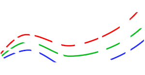
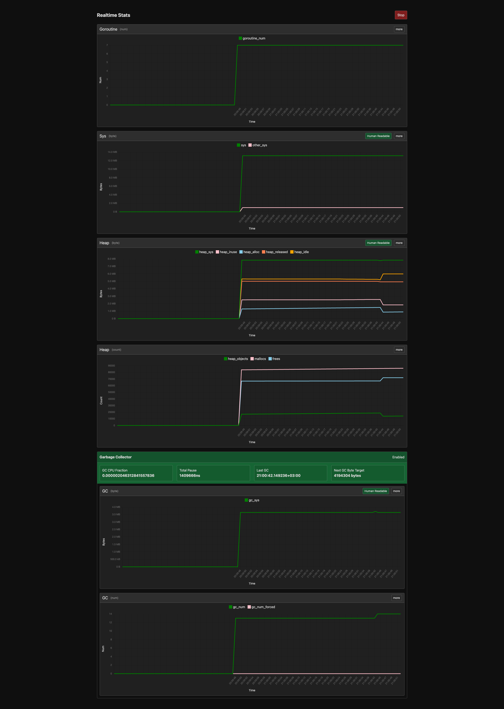

# Stati



### Go runtime realtime monitoring package

## Installation

> requires go version `1.21` or later

```shell
go get -u github.com/ksckaan1/stati
```

## Features
- Run/Stop fetching new monitoring data,
- Show stats in table or line graph mode,
- Toggle Human Readable / Byte mode in sizes,
- Simple and elegant theme,
- Show/hide labels in line graph,
- Show min, max, first and last values of stats on table mode.


## Usage

```go
package main

import (
	"github.com/ksckaan1/stati"
	"log"
)

func main() {
	s := stati.New()
	if err := s.Start(5678); err != nil {
		log.Fatalln(err)
	}
}
```

or use concurrent

```go
package main

import (
	"github.com/ksckaan1/stati"
	"log"
)

func main() {
	s := stati.New()
	go func() {
		if err := s.Start(5678); err != nil {
			log.Fatalln(err)
		}
	}()

	// other processes ...
}
```

### Config
```go
s := stati.New(&stati.Config{
    Name:          "My Realtime Stats", // default: Realtime Stats
	FetchInterval: time.Second, // default: 1 second
})
```

## Dependencies

- There is no dependency for Go side.

Frontend written in [Svelte](https://github.com/sveltejs/svelte)

## Screenshot

