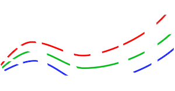
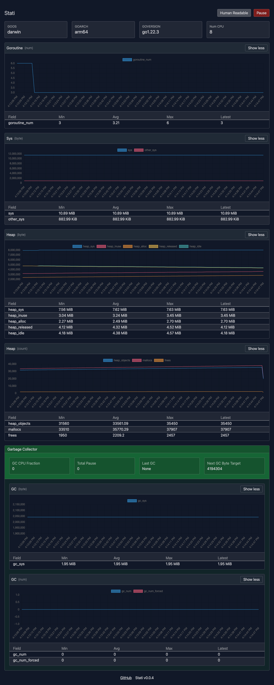

# Stati

<center></center>

### Realtime monitoring for Go Runtime

[](https://github.com/ksckaan1/stati/releases)

[](https://goreportcard.com/report/github.com/ksckaan1/stati)
[](https://github.com/ksckaan1/stati/graphs/contributors)
[](./LICENSE)

## Installation

```shell
go get -u github.com/ksckaan1/stati
```

## Features
- Run/Stop fetching new monitoring data,
- Show stats in table or line graph mode,
- Simple and elegant theme,
- Show/hide labels in line graph,
- Show min, max, avarage and last values of stats on table mode.


## Usage

```go
package main

import (
	"log"
	"time"

	"github.com/ksckaan1/stati"
)

func main() {
	s := stati.New().
		WithAddr(":3000").
		WithChartBuffer(100).
		WithInterval(time.Second).
		WithTitle("Stati")

	err := s.Start()
	if err != nil {
		log.Fatalln(err)
	}
}
```

or use concurrent

```go
package main

import (
	"log"
	"time"

	"github.com/ksckaan1/stati"
)

func main() {
	s := stati.New().
		WithAddr(":3000").
		WithChartBuffer(100).
		WithInterval(time.Second).
		WithTitle("Stati")

	go func(){
		err := s.Start()
		if err != nil {
			log.Fatalln(err)
		}
	}()

	// other processes ...
}
```

Open [http://localhost:3000/stati](http://localhost:3000/stati) on your browser.

## Dependencies
- [Templ](https://github.com/a-h/templ)
- [Alpine.js](https://github.com/alpinejs/alpine)
- [Chart.js](https://github.com/chartjs/Chart.js)
- [Tailwindcss](https://github.com/tailwindlabs/tailwindcss)

## Screenshot

